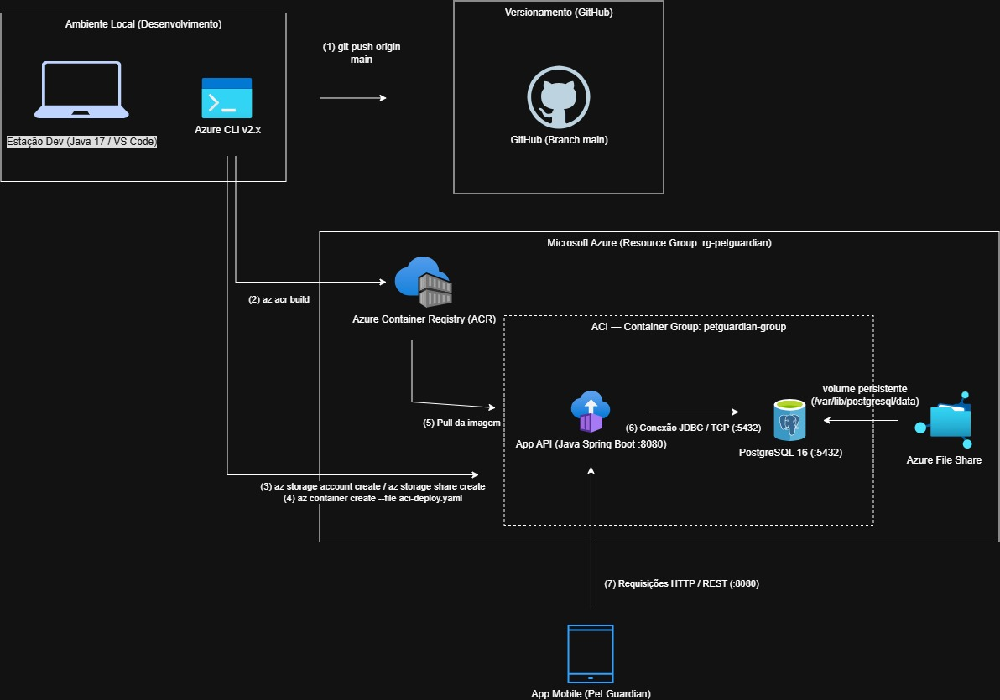

# DevOps-Tools-Cloud-Computing - 🐾 PetGuardian

> **DevOps Tools & Cloud Computing**
> 
> API REST em .NET 10 desenvolvida para facilitar o **cuidado colaborativo de pets**. Focada na gestão de tarefas de saúde prescritas por veterinários, círculos de cuidado compartilhados, histórico clínico unificado e gamificação baseada em pontos.

---

## 🛠️ Tecnologias & Badges


---

## Repositório Github e Vídeo de Apresentação

[Repositório Github](https://github.com/Challenge-Pet-Guardian-3/DevOps-Tools-Cloud-Computing) | [Vídeo de Demonstração]()

---

## 👥 Integrantes

| Nome | RM | Turma | GitHub | LinkedIn |
| :--- | :---: | :---: | :--- | :--- |
| **Enzo Okuizumi** | **561432** | 2TDSPG | [EnzoOkuizumiFiap](https://github.com/EnzoOkuizumiFiap) | [Enzo Okuizumi](https://www.linkedin.com/in/enzo-okuizumi-b60292256/) |
| **Gustavo Okada** | **563428** | 2TDSPG | [Gdev3356](https://github.com/Gdev3356) | [Gustavo Okada](https://www.linkedin.com/in/gustavo-okada-53a3b8359/) |
| **Lucas Barros Gouveia** | **566422** | 2TDSPG | [LuzBGouveia](https://github.com/LuzBGouveia) | [Lucas Barros Gouveia](https://www.linkedin.com/in/lucas-barros-gouveia-09b147355/) |
| **Luna de Carvalho Guimarães** | **562290** | 2TDSPG | [lunaguima](https://github.com/lunaguima) | [Luna M. Guimarães](https://www.linkedin.com/in/luna-m-guimar%C3%A3es-1850ab173/) |
| **Milton Marcelino** | **564836** | 2TDSPG | [MiltonMarcelino](https://github.com/MiltonMarcelino) | [Milton Marcelino](http://linkedin.com/in/milton-marcelino-250298142) |

---

## 💡 Sobre o Produto

O **PetGuardian** foi concebido para resolver o problema da descentralização do cuidado diário de animais domésticos quando mais de um cuidador está envolvido. A plataforma organiza responsabilidades, registra o histórico de saúde e incentiva a realização de tarefas através de um sistema gamificado centrado no animal.

### 🌟 Pilares da Arquitetura Pet-Centric & DevOps
* **Círculo de Cuidado Colaborativo:** Vínculo dinâmico `N:N` entre cuidadores (`Usuario`) e `Pet` via tabela associativa gerenciada.
* **Rotina Familiar Desacoplada:** Divisão de tarefas diárias familiares com pontuação proporcional ao cuidado.
* **Histórico Clínico Unificado:** Consolidação cronológica contendo atendimentos clínicos veterinários, vacinas e pesagens.
* **Gamificação Pet-Centric:** Score de Bem-Estar cumulativo acumulado **diretamente no Pet** à medida que a família cumpre os cuidados e módulos educativos.
* **Infraestrutura Serverless Containerizada:** Deploy da API .NET no **Azure Container Instances (ACI)** a partir de imagens privadas no **Azure Container Registry (ACR)**, com banco de dados Oracle containerizado com volume persistente no Azure Files e segurança non-root (`USER appuser`).

### 🗄️ Modelagem Relacional do Banco de Dados

### 📐 Modelo Lógico


### 🗄️ Modelo Relacional


---

## 📂 Estrutura do Repositório

```text
PetGuardian/
  ├── PetGuardian.API/         # Endpoints, Middlewares e Injeção de Dependência
  ├── PetGuardian.Application/ # Camada de Aplicação (DTOs, Regras de Negócio e Serviços)
  ├── PetGuardian.Domain/      # Entidades Core de Domínio e Invariantes
  ├── PetGuardian.Infrastructure/ # Persistência (EF Core, Configurações Oracle e Migrations)
  ├── docker-compose.yml       # Orquestração do Banco Oracle + API na VM Azure
  └── DEPLOYMENT.md            # Guia complementar de deploy
```

---

## 📈 Benefícios da Solução para o Negócio
* **Centralização do Cuidado:** Consolida o histórico clínico de pets e tarefas diárias, eliminando falhas de comunicação entre tutores e co-cuidadores.
* **Engajamento e Fidelização:** A gamificação (sistema de score) motiva a participação ativa nas tarefas cotidianas de saúde do pet, convertendo obrigações em interações gamificadas.
* **Prevenção de Complicações Médicas:** O acompanhamento cronológico rigoroso de medicamentos, vacinas e consultas evita esquecimentos e complicações de saúde, reduzindo custos com internações emergenciais.
* **Portabilidade e Nuvem:** O uso de containers Docker garante que a aplicação execute com consistência absoluta desde o desenvolvimento local até a infraestrutura em nuvem na VM Azure.

---

## 📐 Desenho Macro da Arquitetura
A arquitetura da solução no ambiente Azure funciona conforme o fluxo de componentes abaixo:



---

## ☁️ Script Completo do Azure CLI
Abaixo está o script sequencial em shell para provisionar a infraestrutura necessária na nuvem Azure e preparar a VM com Docker:

```bash

 
```

---

## 🐋 Dockerfile & Docker Compose da Aplicação

### Dockerfile da API (Segurança Não-Root)
Localizado em `PetGuardian.API/Dockerfile`:
```dockerfile

```

## 📖 Instruções de Instalação e Execução na VM (How To)

### 1. Build e Upload da Imagem (Máquina de Desenvolvimento Local)
```bash
# Efetue login no Docker Hub
docker login

# Build e Tags da imagem
docker build -t petguardian-api:v1 -f PetGuardian/PetGuardian.API/Dockerfile PetGuardian/
docker tag petguardian-api:v1 enzookuizumi/petguardian-api:v1

# Enviar imagem
docker push enzookuizumi/petguardian-api:v1
```

### 2. Execução do Deploy na VM Azure (Passo a Passo)
1. **Conecte via SSH na VM provisionada:**
   ```bash
   ssh azureuser@<IP_PUBLICO_DA_VM>
   ```
2. **Clone seu repositório na VM:**
   ```bash
   git clone https://github.com/Enzo-C/DevOps-Tools-Cloud-Computing.git challenge-devops
   cd challenge-devops/PetGuardian
   ```
3. **Edite o arquivo `docker-compose.yml` para referenciar a imagem do Docker Hub:**
   ```bash
   nano docker-compose.yml
   # Modifique a propriedade "image" do serviço "petguardian-api" para:
   # image: enzookuizumi/petguardian-api:v1
   ```
4. **Execute os containers em background:**
   ```bash
   docker compose up -d
   ```
5. **Verifique se as tabelas foram migradas e a aplicação está saudável:**
   ```bash
   docker compose ps
   docker logs petguardian-api
   ```
6. **Acesse remotamente o Swagger da API via IP público:**
   * URL: `http://<IP_PUBLICO_DA_VM>:8080/index.html`

---

## 📋 Documentação de Rotas (OpenAPI / Swagger)

### Usuários
| Método | Rota | Descrição |
|--------|------|-----------|
| GET | /api/usuario | Listar todos os usuários |
| GET | /api/usuario/{id} | Buscar usuário por ID |
| GET | /api/usuario/by-email | Buscar usuário por e-mail |
| GET | /api/usuario/{id}/score | Buscar score e progresso do usuário |
| POST | /api/usuario | Cadastrar um novo usuário |
| DELETE | /api/usuario/{id} | Remover um usuário |

### Pets
| Método | Rota | Descrição |
|--------|------|-----------|
| GET | /api/pet | Listar todos os pets |
| GET | /api/pet/{id} | Buscar pet por ID |
| GET | /api/pet/by-raca/{racaId} | Buscar pets por raça |
| GET | /api/pet/{id}/historico | Buscar histórico clínico e de cuidados do pet |
| POST | /api/pet | Cadastrar um novo pet |
| DELETE | /api/pet/{id} | Remover um pet |

### Rede de Cuidado (UsuarioPet)
| Método | Rota | Descrição |
|--------|------|-----------|
| GET | /api/usuariopet | Listar todos os vínculos de rede de cuidado |
| GET | /api/usuariopet/by-usuario/{usuarioId} | Listar pets vinculados a um usuário |
| GET | /api/usuariopet/by-pet/{petId} | Listar cuidadores vinculados a um pet |
| GET | /api/usuariopet/rede-cuidado/{usuarioId} | Buscar rede de cuidado colaborativo de um usuário |
| POST | /api/usuariopet | Vincular um usuário a um pet |
| POST | /api/usuariopet/invite/by-usuario | Convidar cuidador por ID (Exclusivo para Responsável Principal) |
| POST | /api/usuariopet/invite/by-email | Convidar cuidador por E-mail (Exclusivo para Responsável Principal) |
| DELETE | /api/usuariopet/{usuarioId}/{petId} | Remover cuidador da rede de um pet |

### Tarefas de Cuidado
| Método | Rota | Descrição |
|--------|------|-----------|
| GET | /api/tarefa | Listar todas as tarefas |
| GET | /api/tarefa/{id} | Buscar tarefa por ID |
| GET | /api/tarefa/by-pet/{petId} | Listar tarefas de um pet |
| GET | /api/tarefa/by-usuario/{usuarioId} | Listar tarefas vinculadas a um usuário |
| GET | /api/tarefa/by-veterinario/{veterinarioId} | Listar tarefas prescritas por um veterinário |
| GET | /api/tarefa/by-status/{statusId} | Listar tarefas por status |
| POST | /api/tarefa | Prescrever/cadastrar uma nova tarefa para um pet |
| POST | /api/tarefa/{id}/concluir | Concluir tarefa (computando os pontos para o score do usuário) |
| DELETE | /api/tarefa/{id} | Deletar uma tarefa |

### Endereços
| Método | Rota | Descrição |
|--------|------|-----------|
| GET | /api/endereco | Listar todos os endereços |
| GET | /api/endereco/{id} | Buscar endereço por ID |
| POST | /api/endereco | Cadastrar endereço buscando dados automaticamente via ViaCEP |
| DELETE | /api/endereco/{id} | Remover um endereço |

### Vínculo de Endereço (UsuarioEndereco)
| Método | Rota | Descrição |
|--------|------|-----------|
| GET | /api/usuarioendereco | Listar todas as relações usuário-endereço |
| GET | /api/usuarioendereco/by-usuario/{usuarioId} | Listar endereços vinculados a um usuário |
| GET | /api/usuarioendereco/by-endereco/{enderecoId} | Listar usuários vinculados a um endereço |
| POST | /api/usuarioendereco | Vincular um endereço a um usuário |
| DELETE | /api/usuarioendereco/{usuarioId}/{enderecoId} | Desvincular endereço de um usuário |

### Telefones
| Método | Rota | Descrição |
|--------|------|-----------|
| GET | /api/telefone | Listar todos os telefones |
| GET | /api/telefone/{id} | Buscar telefone por ID |
| POST | /api/telefone | Cadastrar um novo telefone |
| DELETE | /api/telefone/{id} | Remover um telefone |

### Raças de Pets
| Método | Rota | Descrição |
|--------|------|-----------|
| GET | /api/raca | Listar todas as raças |
| GET | /api/raca/{id} | Buscar raça por ID |
| POST | /api/raca | Cadastrar uma nova raça |
| DELETE | /api/raca/{id} | Remover uma raça |

### Cidades
| Método | Rota | Descrição |
|--------|------|-----------|
| GET | /api/cidade | Listar todas as cidades |
| GET | /api/cidade/{id} | Buscar cidade por ID |
| GET | /api/cidade/by-estado/{estadoId} | Listar cidades de um estado |
| POST | /api/cidade | Cadastrar uma nova cidade |
| DELETE | /api/cidade/{id} | Remover uma cidade |

### Bairros
| Método | Rota | Descrição |
|--------|------|-----------|
| GET | /api/bairro | Listar todos os bairros |
| GET | /api/bairro/{id} | Buscar bairro por ID |
| GET | /api/bairro/by-cidade/{cidadeId} | Listar bairros de uma cidade |
| POST | /api/bairro | Cadastrar um novo bairro |
| DELETE | /api/bairro/{id} | Remover um bairro |

### Estados
| Método | Rota | Descrição |
|--------|------|-----------|
| GET | /api/estado | Listar todos os estados |
| GET | /api/estado/{id} | Buscar estado por ID |
| POST | /api/estado | Cadastrar um novo estado |
| DELETE | /api/estado/{id} | Remover um estado |

### Status
| Método | Rota | Descrição |
|--------|------|-----------|
| GET | /api/status | Listar todos os status |
| GET | /api/status/{id} | Buscar status por ID |
| POST | /api/status | Cadastrar um novo status |
| DELETE | /api/status/{id} | Remover um status |
