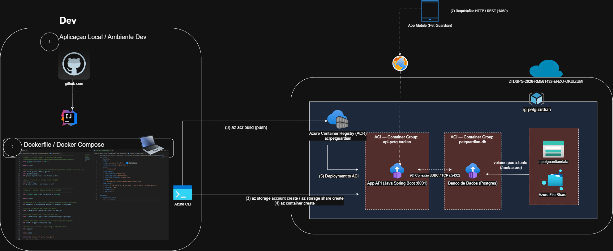
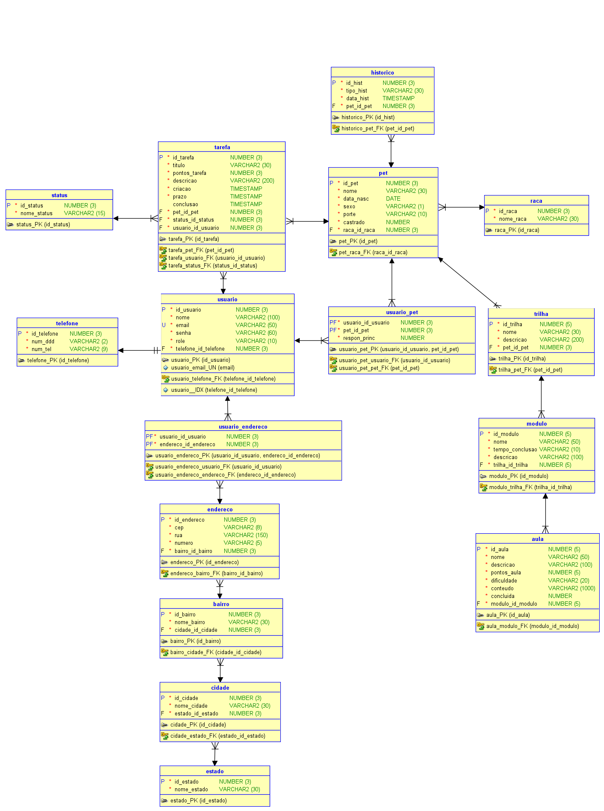

# DevOps-Tools-Cloud-Computing — 🐾 PetGuardian

> **DevOps Tools & Cloud Computing — Sprint 3**
>
> API REST em **Java Spring Boot 4.1.1** para gestão colaborativa do cuidado de pets. Arquitetura 100% containerizada na Microsoft Azure utilizando **ACR + ACI** com banco de dados **PostgreSQL 16** em container com volume persistente.

---

## 🛠️ Tecnologias & Badges


---

## 🔗 Repositório GitHub e Vídeo de Apresentação

[Repositório GitHub](https://github.com/Challenge-Pet-Guardian-3/DevOps-Tools-Cloud-Computing) | [Vídeo de Demonstração]()

---

## 👥 Integrantes

| Nome | RM | Turma | GitHub | LinkedIn |
| :--- | :---: | :---: | :--- | :--- |
| **Enzo Okuizumi** | **561432** | 2TDSPG | [EnzoOkuizumiFiap](https://github.com/EnzoOkuizumiFiap) | [Enzo Okuizumi](https://www.linkedin.com/in/enzo-okuizumi-b60292256/) |
| **Gustavo Okada** | **563428** | 2TDSPG | [Gdev3356](https://github.com/Gdev3356) | [Gustavo Okada](https://www.linkedin.com/in/gustavo-okada-53a3b8359/) |
| **Lucas Barros Gouveia** | **566422** | 2TDSPG | [LuzBGouveia](https://github.com/LuzBGouveia) | [Lucas Barros Gouveia](https://www.linkedin.com/in/lucas-barros-gouveia-09b147355/) |
| **Luna de Carvalho Guimarães** | **562290** | 2TDSPG | [lunaguima](https://github.com/lunaguima) | [Luna M. Guimarães](https://www.linkedin.com/in/luna-m-guimar%C3%A3es-1850ab173/) |
| **Milton Marcelino** | **564836** | 2TDSPG | [MiltonMarcelino](https://github.com/MiltonMarcelino) | [Milton Marcelino](http://linkedin.com/in/milton-marcelino-250298142) |

---

## 💡 Sobre o Produto

O **PetGuardian** resolve o problema da descentralização do cuidado diário de animais domésticos quando múltiplos cuidadores estão envolvidos. A plataforma organiza responsabilidades, registra o histórico clínico e incentiva a realização de tarefas através de um sistema gamificado centrado no bem-estar do animal.

### 🌟 Pilares da Arquitetura Pet-Centric

* **Círculo de Cuidado Colaborativo:** Vínculo dinâmico `N:N` entre cuidadores (`Usuario`) e `Pet` via tabela associativa `usuario_pet`.
* **Tarefas de Saúde Gamificadas:** Cada tarefa concluída acumula pontos para o cuidador responsável.
* **Histórico Clínico Unificado:** Consolidação cronológica de vacinas, consultas e pesagens do pet.
* **Infraestrutura 100% Containerizada:** API Java e banco PostgreSQL executando no **Azure Container Instances (ACI)**, imagens gerenciadas no **Azure Container Registry (ACR)**, persistência garantida por **Azure Files**.

---

## 📈 Benefícios para o Negócio

* **Centralização do Cuidado:** Elimina falhas de comunicação entre tutores e co-cuidadores ao centralizar histórico e responsabilidades em uma única plataforma.
* **Engajamento por Gamificação:** O sistema de pontuação por tarefa converte obrigações de saúde em interações motivadoras, aumentando a retenção e o engajamento ativo dos cuidadores.
* **Prevenção de Complicações Médicas:** O acompanhamento rigoroso de prazos de vacinas, medicamentos e consultas evita esquecimentos que poderiam resultar em internações emergenciais e custos elevados.
* **Portabilidade e Escalabilidade:** Arquitetura containerizada garante paridade entre desenvolvimento local e nuvem, permitindo escalar os containers de API e banco de forma independente conforme a demanda.
* **Segurança e Auditabilidade:** Controle de acesso por JWT (OAuth2 Resource Server com RSA) e histórico de atendimentos auditável permitem rastreabilidade completa das ações dos cuidadores.

---

## 📐 Desenho Macro da Arquitetura

A arquitetura da solução utiliza exclusivamente a **Opção 1 (ACR + ACI)** do edital, com todos os recursos provisionados 100% via Azure CLI:



### Fluxo da Arquitetura

```
[Desenvolvedor] ──(1)──► docker build / docker push ──► [ACR: acrpetguardian]
                                                                │
[ACR] ──────────────────────────────────────────────────(2)──► [ACI: aci-api-petguardian]
                                                                │ porta 8091
[Azure Files: stpetguardiandata] ──────volume mount─────(3)──► [ACI: aci-db-petguardian]
                                                                │ porta 5432 (PostgreSQL)
[Cliente/Swagger] ──────────────────────(4)──► [aci-api-petguardian:8091] ──► [aci-db-petguardian:5432]
```

| Componente Azure | Recurso | Função |
| :--- | :--- | :--- |
| Resource Group | `rg-petguardian` | Agrupamento lógico de todos os recursos |
| Container Registry | `acrpetguardian` | Repositório privado de imagens Docker |
| Container Instance | `aci-api-petguardian` | Executa a API Java Spring Boot na porta 8091 |
| Container Instance | `aci-db-petguardian` | Executa o PostgreSQL 16 na porta 5432 |
| Storage Account | `stpetguardiandata` | Conta de armazenamento para persistência |
| File Share | `pgdata` | Volume montado em `/var/lib/postgresql/data` |

---

## 📂 Estrutura do Repositório

```text
DevOps-Tools-Cloud-Computing/
  ├── Java-Advanced/           # Código-fonte da API Java Spring Boot
  │   ├── src/                 # Pacotes da aplicação
  │   ├── build.gradle         # Configuração de build Gradle
  │   ├── compose.yml          # Docker Compose para ambiente local de desenvolvimento
  │   └── Dockerfile           # Dockerfile multi-stage com usuário non-root (appuser)
  ├── docs/
  │   ├── challenge3-petguardian.drawio.png # Diagrama oficial de arquitetura Cloud Azure
  │   ├── Logical.png          # Modelo lógico do banco de dados
  │   └── Relational.png       # Modelo relacional do banco de dados
  ├── script.sh                # Script Azure CLI para Bash / Git Bash / Linux
  ├── script-powershell.sh     # Script Azure CLI adaptado para PowerShell / Windows
  ├── script-powershell.ps1    # Script nativo PowerShell (.ps1) para Windows
  └── script_bd.sql            # DDL das tabelas CORE com comentários (PostgreSQL)
```

---

## 🗄️ Modelagem do Banco de Dados

### 📐 Modelo Lógico


### 🗄️ Modelo Relacional


---

## 🐋 Dockerfile da API Java (Multi-Stage + Non-Root)

O container da API **não executa como root ou admin**, conforme requisito obrigatório do edital (item 8.2, penalidade de -10 pts). O `Dockerfile` está em `Java-Advanced/Dockerfile`:

```dockerfile
# Stage 1 — BUILD: compilação com Gradle
FROM gradle:jdk17 AS build
WORKDIR /app
COPY build.gradle settings.gradle ./
COPY gradle/ gradle/
RUN gradle dependencies --no-daemon || true
COPY src/ src/
RUN gradle bootJar --no-daemon -x test

# Stage 2 — RUNTIME: imagem mínima de produção
FROM eclipse-temurin:17-jre-alpine AS runtime
WORKDIR /app

# Cria usuário e grupo sem privilégios administrativos
RUN addgroup -S appgroup && adduser -S appuser -G appgroup

COPY --from=build /app/build/libs/pet-guardian-0.0.1-SNAPSHOT.jar app.jar
COPY --from=build /app/src/main/resources/keys/ /app/keys/
RUN chown -R appuser:appgroup /app

# Executa como usuário não privilegiado
USER appuser

EXPOSE 8091
ENTRYPOINT ["java", "-jar", "app.jar"]
```

---

## 🚀 Como Executar — How To (Deploy Completo)

### Pré-requisitos

* [Azure CLI](https://learn.microsoft.com/pt-br/cli/azure/install-azure-cli) instalado e autenticado (`az login`)
* [Docker Desktop](https://www.docker.com/products/docker-desktop/) instalado e rodando
* Acesso à assinatura Azure com permissões de Contributor

---

### 1. Clone do Repositório (Ponto de Partida Obrigatório)

```bash
git clone https://github.com/Challenge-Pet-Guardian-3/DevOps-Tools-Cloud-Computing.git
cd DevOps-Tools-Cloud-Computing
```

---

### 2. Execução Local com Docker Compose (Desenvolvimento)

Execute localmente antes do deploy em nuvem para validar a aplicação:

```bash
cd Java-Advanced

# Sobe o banco PostgreSQL localmente
docker compose up -d

# Build da imagem da API
docker build -t petguardian-api:local .

# Executa a API conectada ao banco local
docker run -d \
  -p 8091:8091 \
  -e PGHOST=host.docker.internal \
  -e PGPORT=5432 \
  -e PGDATABASE=petguardian \
  -e PGUSER=petguardian \
  -e PGPASSWORD=petguardian \
  --name petguardian-api \
  petguardian-api:local

# Acesse o Swagger local:
# http://localhost:8091/swagger-ui/index.html
```

---

### 3. Deploy na Nuvem Azure — Script CLI Completo

> **Atenção:** Todos os recursos são criados 100% via Azure CLI (nenhum passo manual no portal).
> Os scripts possuem validação de integridade embutida: aguardam a porta 5432 do PostgreSQL aceitar conexões e monitoram a inicialização da API até o endpoint `/actuator/health` retornar `HTTP 200 OK`, exibindo os logs reais e as URLs de acesso.

#### No Windows (PowerShell):
```powershell
cd DevOps-Tools-Cloud-Computing

# Opcional: configurar credenciais e região (padrão: canadacentral)
$env:DB_USER = "petguardian"
$env:DB_PASSWORD = "petguardian_senha"
$env:LOCATION = "canadacentral"

# Executar o script de automação:
.\script-powershell.sh
# ou:
.\script-powershell.ps1
```

#### No Linux / macOS / Git Bash:
```bash
cd DevOps-Tools-Cloud-Computing

# Exporte as variáveis sensíveis
export DB_USER="petguardian"
export DB_PASSWORD="petguardian_senha"
export LOCATION="canadacentral"

# Dê permissão e execute:
chmod +x ./script.sh
./script.sh
```

O script executa as seguintes etapas automaticamente:

| Etapa | Comando Principal | O que faz |
| :---: | :--- | :--- |
| 1 | `az group create` | Cria o Resource Group `rg-petguardian` |
| 2 | `az acr create` | Cria o Azure Container Registry privado |
| 3 | `az storage account create` | Cria a conta de armazenamento para o volume |
| 4 | `az storage share create` | Cria o File Share `pgdata` para persistência do banco |
| 5 | `docker pull / tag / push` | Envia imagem PostgreSQL 16 para o ACR |
| 6 | `az container create` (banco) | Sobe o container PostgreSQL no ACI com volume montado e testa a porta 5432 |
| 7 | `docker build / push` | Builda e envia a imagem da API Java para o ACR |
| 8 | `az container create` (API) | Sobe o container da API Java no ACI com roteamento resiliente por IP |
| 9 | `Health Check & Logs` | Monitora subida no `/actuator/health` e exibe logs e endpoints finais |

---

### 4. Verificação do Deploy

```bash
# Lista todos os containers provisionados
az container list --resource-group rg-petguardian --output table

# Verifica logs da API
az container logs --resource-group rg-petguardian --name aci-api-petguardian

# Verifica logs do banco
az container logs --resource-group rg-petguardian --name aci-db-petguardian

# Acesse o Swagger em nuvem:
# http://api-petguardian.<regiao>.azurecontainer.io:8091/swagger-ui/index.html
# (ou pelo IP público exibido no término do script)
```

---

## 🧪 Guia de Testes — Evidência de Persistência (CRUD + SELECT)

Este roteiro demonstra cada operação CRUD evidenciada diretamente no banco de dados PostgreSQL via `SELECT`. Execute na ordem para o vídeo de apresentação.

### Acesso ao Banco via psql (dentro do container ACI)

```bash
az container exec \
  --resource-group rg-petguardian \
  --name aci-db-petguardian \
  --exec-command "psql -U petguardian -d petguardian"
```

---

### 📌 Passo 1 — Autenticação (obter token JWT)

```bash
# POST /login — Login para obter o Bearer Token
curl -X POST http://api-petguardian.canadacentral.azurecontainer.io:8091/login \
  -H "Content-Type: application/json" \
  -d '{"email": "usuario@petguardian.com", "senha": "senha123"}'
```

---

### 📌 Passo 2 — Criar Pet (INSERT + SELECT)

**Criar uma raça:**
```bash
curl -X POST http://api-petguardian.canadacentral.azurecontainer.io:8091/pets/raca \
  -H "Authorization: Bearer <TOKEN>" \
  -H "Content-Type: application/json" \
  -d '{"nomeRaca": "Labrador"}'
```

**Criar um pet:**
```bash
curl -X POST http://api-petguardian.canadacentral.azurecontainer.io:8091/pets \
  -H "Authorization: Bearer <TOKEN>" \
  -H "Content-Type: application/json" \
  -d '{
    "nome": "Rex",
    "dataNasc": "2022-03-15",
    "racaId": 1,
    "porte": "GRANDE",
    "sexo": "M",
    "castrado": true
  }'
```

**Evidência no banco (SELECT):**
```sql
-- Evidência de INSERT: confirma que o pet foi persistido
SELECT id_pet, nome, data_nasc, porte, sexo, castrado
FROM pet
ORDER BY id_pet DESC
LIMIT 5;
```

---

### 📌 Passo 3 — Atualizar Pet (UPDATE + SELECT)

```bash
curl -X PUT http://api-petguardian.canadacentral.azurecontainer.io:8091/pets/1 \
  -H "Authorization: Bearer <TOKEN>" \
  -H "Content-Type: application/json" \
  -d '{
    "nome": "Rex Atualizado",
    "dataNasc": "2022-03-15",
    "racaId": 1,
    "porte": "GRANDE",
    "sexo": "M",
    "castrado": false
  }'
```

**Evidência no banco (SELECT):**
```sql
-- Evidência de UPDATE: confirma que os dados foram alterados
SELECT id_pet, nome, castrado FROM pet WHERE id_pet = 1;
```

---

### 📌 Passo 4 — Criar Tarefa para o Pet (INSERT + SELECT em tabela relacionada)

```bash
curl -X POST http://api-petguardian.canadacentral.azurecontainer.io:8091/tarefas \
  -H "Authorization: Bearer <TOKEN>" \
  -H "Content-Type: application/json" \
  -d '{
    "titulo": "Vacina Antirrábica",
    "descricao": "Vacina anual obrigatória - dose de reforço",
    "pontosTarefa": 50,
    "prazo": "2026-10-01T10:00:00",
    "petId": 1
  }'
```

**Evidência no banco (SELECT em 2 tabelas relacionadas):**
```sql
-- Evidência de INSERT em tarefa + join com pet (2 tabelas relacionadas)
SELECT t.id_tarefa, t.titulo, t.pontos_tarefa, t.prazo, s.nome_status, p.nome AS nome_pet
FROM tarefa t
JOIN status s ON s.id_status = t.status_id_status
JOIN pet p ON p.id_pet = t.pet_id_pet
ORDER BY t.id_tarefa DESC
LIMIT 5;
```

---

### 📌 Passo 5 — Concluir Tarefa (PATCH + SELECT)

```bash
curl -X PATCH http://api-petguardian.canadacentral.azurecontainer.io:8091/tarefas/1/concluir \
  -H "Authorization: Bearer <TOKEN>"
```

**Evidência no banco (SELECT):**
```sql
-- Evidência de PATCH: confirma que status mudou para CONCLUIDO e conclusao foi preenchido
SELECT id_tarefa, titulo, conclusao, status_id_status FROM tarefa WHERE id_tarefa = 1;
```

---

### 📌 Passo 6 — Excluir Tarefa (DELETE + SELECT)

```bash
curl -X DELETE http://api-petguardian.canadacentral.azurecontainer.io:8091/tarefas/1 \
  -H "Authorization: Bearer <TOKEN>"
```

**Evidência no banco (SELECT):**
```sql
-- Evidência de DELETE: confirma que o registro não existe mais
SELECT COUNT(*) AS total_tarefas FROM tarefa WHERE id_tarefa = 1;
-- Resultado esperado: total_tarefas = 0
```

---

## 📋 Documentação de Rotas (OpenAPI / Swagger)

Swagger disponível em: `http://api-petguardian.<regiao>.azurecontainer.io:8091/swagger-ui/index.html` (ou pelo IP público)

### Autenticação
| Método | Rota | Descrição |
|:---:|:---|:---|
| POST | /login | Login e geração do token JWT (Bearer) |

### Pets (Entidade CORE — CRUD Completo)
| Método | Rota | Descrição |
|--------|------|-----------|
| GET | /pets | Listar todos os pets |
| GET | /pets/by-usuario | Listar pets do usuário autenticado |
| GET | /pets/by-nome | Buscar pet por nome |
| GET | /pets/{id} | Buscar pet por ID |
| GET | /pets/{id}/historico | Buscar histórico clínico do pet |
| GET | /pets/{id}/pontos | Buscar score acumulado do pet |
| POST | /pets | Cadastrar novo pet |
| PUT | /pets/{id} | Atualizar dados do pet |
| DELETE | /pets/{id} | Remover pet |

### Tarefas de Cuidado (Entidade CORE — CRUD Completo)
| Método | Rota | Descrição |
|--------|------|-----------|
| GET | /tarefas | Listar todas as tarefas |
| GET | /tarefas/by-usuario | Listar tarefas do usuário autenticado |
| GET | /tarefas/by-pet/{petId} | Listar tarefas de um pet |
| GET | /tarefas/{id} | Buscar tarefa por ID |
| GET | /tarefas/by-usuario/{usuarioId}/{id} | Buscar tarefa específica de um usuário |
| GET | /tarefas/by-usuario/pontos | Score total de pontos do usuário |
| POST | /tarefas | Criar nova tarefa de cuidado |
| PUT | /tarefas/{id} | Atualizar tarefa |
| PATCH | /tarefas/{id}/concluir | Marcar tarefa como concluída (acumula pontos) |
| PATCH | /tarefas/{id}/desmarcar | Desmarcar conclusão da tarefa |
| DELETE | /tarefas/{id} | Remover tarefa |

### Rede de Cuidado — UsuarioPet (Círculo Colaborativo)
| Método | Rota | Descrição |
|--------|------|-----------|
| GET | /pets/{petId}/cuidadores | Listar cuidadores de um pet |
| POST | /pets/{petId}/cuidadores | Adicionar co-cuidador ao pet |
| DELETE | /pets/{petId}/cuidadores/{usuarioId} | Remover cuidador do pet |
| PATCH | /pets/{petId}/responsavel-principal | Transferir responsabilidade principal |

### Usuários
| Método | Rota | Descrição |
|--------|------|-----------|
| GET | /usuarios | Listar todos os usuários |
| GET | /usuarios/{id} | Buscar usuário por ID |
| POST | /usuarios | Cadastrar novo usuário |
| PUT | /usuarios/{id} | Atualizar usuário |
| DELETE | /usuarios/{id} | Remover usuário |

### Histórico Clínico
| Método | Rota | Descrição |
|--------|------|-----------|
| GET | /historicos | Listar todos os históricos |
| GET | /historicos/{id} | Buscar histórico por ID |
| POST | /historicos | Registrar novo evento clínico |
| DELETE | /historicos/{id} | Remover registro histórico |

### Trilhas & Módulos (Conteúdo Educativo)
| Método | Rota | Descrição |
|--------|------|-----------|
| GET | /trilhas | Listar trilhas educativas do pet |
| GET | /modulos | Listar módulos de uma trilha |
| GET | /aulas | Listar aulas de um módulo |
